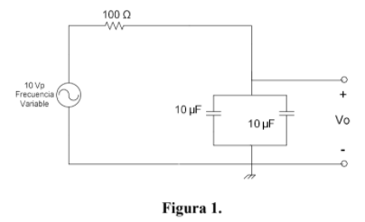
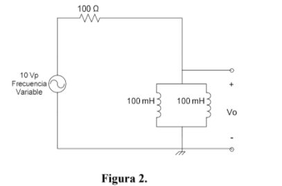

# PRACTICA-NO.-8.-INDUCTOR-Y-CAPACITOR
# iNFORME

1. OBJETIVOS 

1.1. OBJETIVO GENERAL

- Analizar el comportamiento de las bobinas y capacitores en un circuito donde se emplea corriente alterna

 1.2. OBJETIVO ESPECIFICO

- Armar un circuito mixto con bobinas y capacitores en un laboratorio virtual
- Relacionar los dierentes instrumentos de medicion al tratarce de circuitos con corriente alterna
- Comparar los calculos analiticos y los obtenidos en el laboratorio virtual

2. MARCO TEORICO

3. DIAGRAMAS

4. LISTA DE COMPONENTES

- Generador de señales
- fuente DC
- Osciloscopio
- Protoboard
- Multimetro
- Cables conductores
- Resistencias, bobinas y capacitores

5. EXPLICACION 

6. CONCLUCION

- Los resultados obtenidos tanto analiticos como el el simuladro tienen una pequeña variacion, esto se debe a la utilizacion de los decimales mas que nada ya que al ser un simuladro virtual los valores obtenidos no deberian variar

7. BIBLIOGRAFIA

- Floyd, T. (2007). PRINCIPIOS DE CIRCUITOS ELÉCTRICOS. (8va ed.). México, México: Pearson Education
