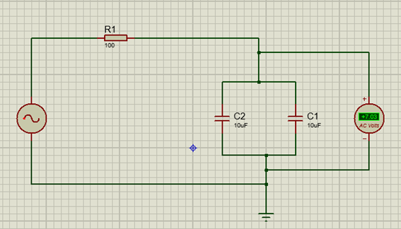

# PRACTICA-NO.-8.-INDUCTOR-Y-CAPACITOR
# iNFORME

1. OBJETIVOS 

1.1. OBJETIVO GENERAL

- Analizar el comportamiento de las bobinas y capacitores en un circuito donde se emplea corriente alterna

 1.2. OBJETIVO ESPECIFICO

- Armar un circuito mixto con bobinas y capacitores en un laboratorio virtual
- Relacionar los dierentes instrumentos de medicion al tratarce de circuitos con corriente alterna
- Comparar los calculos analiticos y los obtenidos en el laboratorio virtual

2. MARCO TEORICO

### **• CAPACITOR** 

Un capacitor o un condensador es un componente pasivo capaz de almacenar energía a través de campos eléctricos Este se clasifica dentro de los componentes pasivos ya que no corta el flujo eléctrico. El capacitor se encuentra en unidad de Faradios (F).

**PARTES**

Consta de tres partes esenciales:

**• Estructura o carcasa de plástico:** Cubre las partes internas del capacitor.

**•	Dialéctico o aislante:** Evita el contacto entre las dos placas.

**•	Placas metálicas:** Almacenan las cargas eléctricas.

**FUNCIONAMIENTO**

Inicialmente cada una de las placas internas tiene el mismo numero de electrones, y cuando conectamos una fuente de voltaje una de las placas pierde electrones y la otra placa los gana. Cuando el capacitor alcanza el mismo voltaje que la fuente de alimentación el movimiento de electrones se detiene.

**TIPOS**

* Electrolíticos

* Cerámicos

* De película

* De  mica

Para la práctica del presente informe hemos utilizado capacitores cerámicos, los cuales no tiene polaridad y tienen un código impreso en una de sus caras el cual siempre viene codificado en pico faradios. Sin embargo, los capacitores son bastante sensibles a los cambios de voltaje y temperatura.

**CAPACITORES EN SERIE Y PARALELO**

Los capacitores se pueden agrupar en serie o en paralelo para obtener un valor de capacitor equivalente o capacitor total. Estos valores se pueden calcular con las siguientes fórmulas:

### **• INDUCTOR**

Un inductor es un componente pasivo hecho de un alambre aislado que almacena energía en forma de campo magnético, debido al fenómeno de la autoinducción, el sentido del flujo del campo magnético se lo puede establecer con la ley de la mano derecha. El inductor se encuentran en valores de Henrios (H).

**PARTES**

El inductor consta básicamente de las siguientes partes: 

**FUNCIONAMIENTO**

Un inductor está constituido por una bobina de material conductor,  normalmente alambre o hilo de cobre esmaltado, el inductor almacena energía cuando aumenta la intensidad de corriente, devolviéndola cuando ésta disminuye. 

**TIPOS**

* Bobinas con núcleos de aire

* Bobinas de núcleo de hierro

* Bobinas con núcleo de ferrita

Para la práctica del presente informe hemos utilizado bobinas o inductores con núcleos de aire, los cuales tienen una baja inductancia y generalmente trabajan con señales eléctricas de alta frecuencia.

**INDUCTORES EN SERIE Y PARALELO**

Los inductores se pueden agrupar en serie o en paralelo para obtener un valor de inductor equivalente o inductor total. Estos valores se pueden calcular con las siguientes fórmulas:

* SERIE 

* PARALELO

3. DIAGRAMAS

4. LISTA DE COMPONENTES

- Generador de señales
- fuente DC
- Osciloscopio
- Protoboard
- Multimetro
- Cables conductores
- Resistencias, bobinas y capacitores

5. EXPLICACION 

- Abrimos el simulador
- Seleccionamos los materiales a utulizar en el primer circuito
- Armamos el primer circuito 
- Vamos variando la frecuencia de la fuente con valores de 0, 10, 50, 100, 500 y 1000 Hz
- En cada una de las variaciones medimos el voltaje pico con el osciloscopio, el voltaje rms con el multimetro que pasa por las capacitancias
- Medimos la corriente que pasa por la resistencia
- Anotamos los resultados 
- Armamos el siguiente circuito
- Repetimos las mismas variaciones y anotamos los resultados 
1. Para cada uno de los circuitos anteriores, elvabore una tabla con los resultados de las diferentes mediociones de voltaje realizado con el osciloscopio y multimetro. Compare y comente los resultados obtenidos tomando en cuenta las distintas frecuencias utilizadas

Si nos fijamos en los valores del primer circuito notamos que mientras aumenta la frecuencia  tanto el voltaje pico como el rms van disminutendo y la corriente que pasa por la resistencia va en  aumento, y  en el segundo circuito ocurre lo contrario, mientras va aumentando la frecuencia los voltajes tambien van en aumento y la corriente va disminuyendo poco a poco

2. ¿Como se comportan la bobina y el capacitor en corriente continua 0Hz?

3. ¿Como se comporta la bobina y el capacitos en corrinte alterna?

Cuando las bobinas son sometidas a corriente con frecuencia (A.C.), cumplen su función de inductancia, es decir además de poseer corriente esta también tiene la presencia de voltaje, debido al efecto de frecuencia.

Con las bobinas ocurre lo contrario el condensador deja pasar corriente, y tiene la presencia del voltaje, todo debido al efecto que tiene la corriente alterna en el elemento

4. ¿Que cree usted que ocurriria con el voltaje Vo y la corriente de la resistencia en los circuitos analizados en esta practica, si se utilizan 2 bobinas o 2 capacitores de valores distintos?

Lo primero sera que la impedancia del circuito va a cambiar y esto dependera de los nuevos valores, tambien tomemos en cuenta que tanto el voltaje como la corriente tambien se veran afectadas y dependiendo puede ser que el Vo aumente como disminuya

5. ¿Que son los valores eficaces de voltaje y corriente?

Tambien conocidos como valor rms son los valores que en corriente alterna que al ser llevado a corriente continua produce el mismo efecto en la dispercion de calor

6. CONCLUCION

- Los resultados obtenidos tanto analiticos como el el simuladro tienen una pequeña variacion, esto se debe a la utilizacion de los decimales mas que nada ya que al ser un simuladro virtual los valores obtenidos no deberian variar
- La frecuencia es un factor clave en los circuitos de corriente alterna, puede hacer que la impediancia aumente o disminuya y si se tiene un valor de 0 la impedancia llega a ser infinita
- Mientras la frecuentia aumenta la reactancia inductiva aumenta mientras que la capacitiva disminuye

7. BIBLIOGRAFIA

- Floyd, T. (2007). PRINCIPIOS DE CIRCUITOS ELÉCTRICOS. (8va ed.). México, México: Pearson Education
